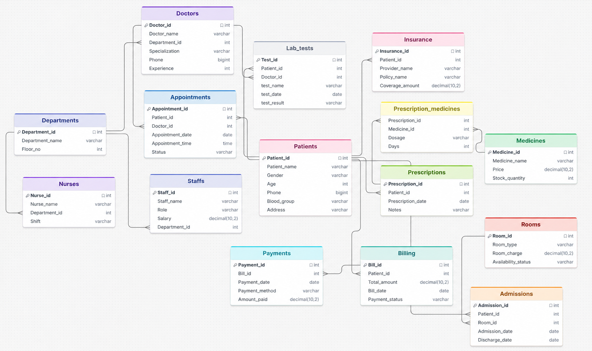

# 🏥 Hospital Analytics System

A comprehensive SQL-based Hospital Analytics System built using MySQL to manage, monitor, and analyze hospital operations. The project simulates a real-world healthcare database and provides insights into patient management, appointments, billing, admissions, prescriptions, insurance, and revenue analytics.
---
## 📌 Project Objectives

- Design a scalable relational database for hospital management.
- Implement efficient SQL queries for operational reporting.
- Perform analytical reporting on hospital data.
- Demonstrate advanced database concepts such as Views, Stored Procedures, Triggers, and Window Functions.
- Provide a foundation for future BI dashboards and healthcare analytics solutions.

---
## 🛠️ Technologies Used

- **MySQL**
- **SQL**
- **MySQL Workbench**
- Relational Database Design
- Data Analytics & Reporting

---
## 📂 Project Structure

```text
Hospital-Analytics-System/
│
├── schema.sql
├── insert_values.sql
├── queries.sql
├── views.sql
├── procedures.sql
├── triggers.sql
├── README.md
└── ER_Diagram.png
```

---

## 🗄️ Database Modules

The system consists of the following core entities:

### Patient Management
- Patients
- Admissions
- Insurance

### Medical Staff Management
- Doctors
- Nurses
- Staffs
- Departments

### Appointment & Treatment
- Appointments
- Prescriptions
- Medicines
- Prescription_Medicines
- Lab_Tests

### Billing & Revenue
- Billing
- Payments

### Infrastructure
- Rooms

---

## 📊 SQL Concepts Demonstrated

### Basic SQL
- SELECT Statements
- Filtering and Sorting
- ORDER BY
- GROUP BY
- HAVING

### Advanced SQL
- Joins (Inner, Left, Right)
- Subqueries
- Common Reporting Queries
- CASE Statements
- Aggregate Functions
- Window Functions

### Database Programming
- Views
- Stored Procedures
- Triggers

### Analytics
- Revenue Analysis
- Patient Statistics
- Appointment Analysis
- Billing Insights
- Medicine Utilization Reports
---
## 🚀 Key Features

✅ Patient Record Management

✅ Doctor & Department Tracking

✅ Appointment Scheduling Analysis

✅ Billing and Payment Monitoring

✅ Insurance Information Management

✅ Prescription & Medicine Tracking

✅ Admission and Room Management

✅ Hospital Revenue Analytics

✅ Advanced Reporting with SQL Views

✅ Automated Business Logic using Triggers

---

## 📈 Sample Analytics Reports

- Monthly Revenue Report
- Department-wise Patient Count
- Top Performing Doctors
- Appointment Trends Analysis
- Outstanding Payment Report
- Most Prescribed Medicines
- Insurance Coverage Analysis

---

## 🖼️ Entity Relationship Diagram

> ER Diagram illustrating relationships among hospital entities.



---

## 🔮 Future Enhancements

- Power BI Dashboard Integration
- Interactive Data Visualization
- Machine Learning-Based Patient Prediction
- Web-Based Hospital Management Portal
- Real-Time Reporting Dashboard
- Role-Based Access Control
---

## 🎯 Learning Outcomes

Through this project, the following database concepts were implemented and practiced:

- Relational Database Design
- Normalization
- SQL Query Optimization
- Database Programming
- Data Analytics Using SQL
- Business Reporting
- Healthcare Data Modeling

---

